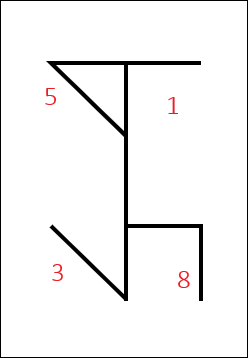
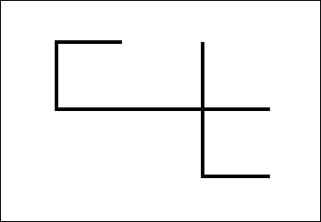

# Sami's Cistercian Numeral Generator
A little project for testing SVG creation using JavaScript. This generator accepts an input of any four-digit integer (between **1** and **9,999**), then outputs a SVG rendition of the equivalent Cistercian numeral for quick reference.

## What are Cistercian Numerals?
Cistercian numerals are a form of numeric ligature developed in the thirteenth century by the Cistercian monastic order as a way of writing numerals using a singular glyph. Originally, it was a two-digit glyph that went from 1 to 99, introduced to the order by archdeacon John of Basingstoke, and was based on *ars notoria*, a form of shorthand used in the twelfth century. The traditional numbers were written using a horizontal "stave", but the vertical stave was used in Northern France until the fourteenth century. When Cistercian numerals made a comeback in the eighteenth and nineteenth centuries in France and Germany, they exclusively used the vertical stave referenced in this generator.

Each glyph consists of one central line (the stave), and up to four additional glyphs; the placement of each glyph denotes the placement of the number (ones, tens, hundreds, or thousands), and the glyph itself is the digit. For example, this is the number **3851** as a Cistercian number:

In vertical-stave glyphs, the number is read from left to right and from bottom to top. In order, each position is:
- Lower left: Thousands
- Lower right: Hundreds
- Upper left: Tens
- Upper right: Ones

Horizontal-stave glyphs are written in much the same way, but the entire glyph is rotated 90 degrees counter-clockwise:

In this case, the number is read from the bottom to top, and from right to left:
- Lower right: Thousands
- Upper right: Hundreds
- Lower left: Tens
- Upper left: Ones

Note that there is no glyph in the tens position for this number; the number 0 doesn't have a glyph, so any placement with a 0 is left vacant.
